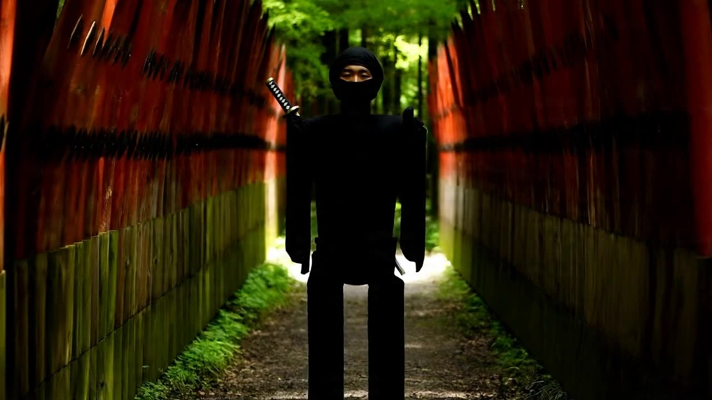
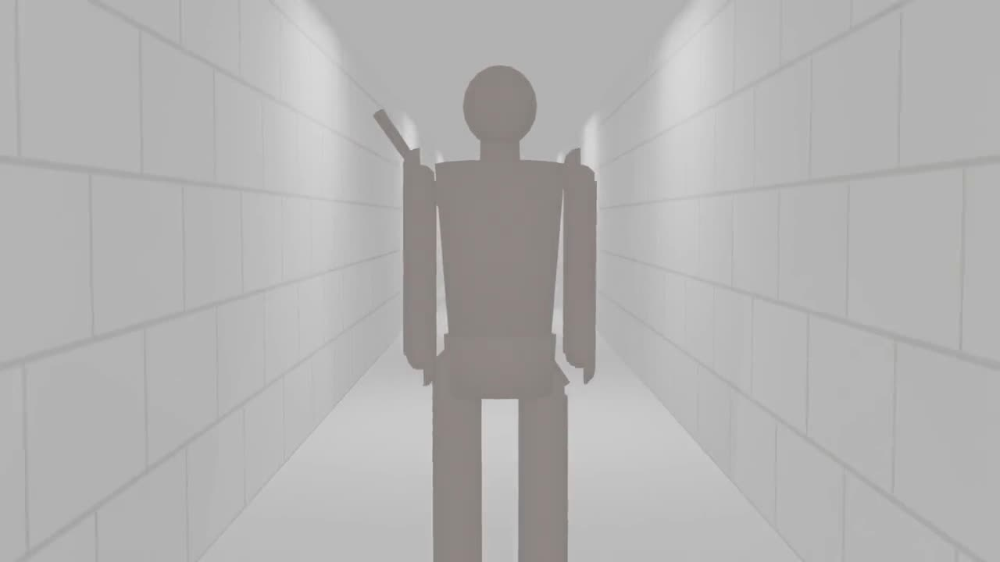
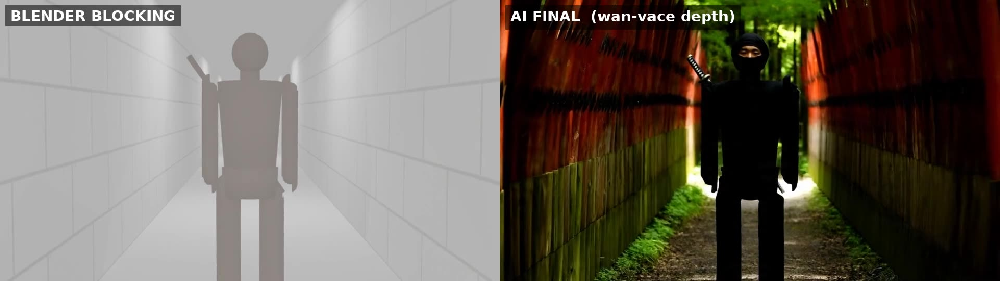
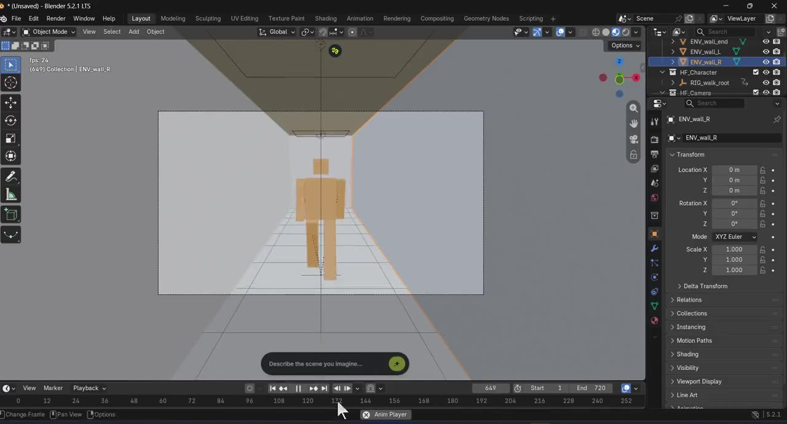
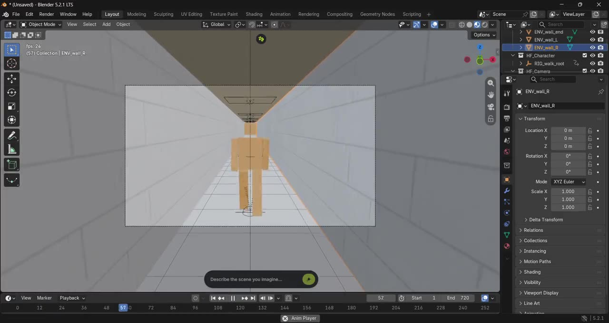

# Claude × Higgsfield Bridge × Blender — Previz by Conversation

A 30-second previz shot — white corridor, box person, one continuous camera move — built **entirely by prompting Claude**, which drives a live Blender session through the [Higgsfield Bridge](https://higgsfield.ai) MCP connector. No manual modeling, no manual keyframing: every object, material, constraint, and camera beat was placed by the agent, verified by numeric audits and real renders.

**Inspiration:** [This Blender + Higgsfield AI Workflow Changes How You Make AI Video](https://www.youtube.com/watch?v=OiULPvTJ-0E&t=720s) (YouTube).

[](https://az9713.github.io/claude-higgsfield-blender-demo/)

**The full development journey** — every prompt, every stage, every bug, every fix — is [`docs/index.html`](docs/index.html), rendered live at **[az9713.github.io/claude-higgsfield-blender-demo](https://az9713.github.io/claude-higgsfield-blender-demo/)** (click the badge above to open it as a web page rather than source).

## Part 2: the previz became a real video — click to play

[](https://az9713.github.io/claude-higgsfield-blender-demo/player.html?v=3)

The v2 previz, fed as a **depth guide** into `fal-ai/wan-vace-14b/depth`, became a 30-second shot of a ninja walking a torii-lined park lane — six $0.20 test iterations, one $2.40 full pass, one $0.40 face-reveal splice: **~$4 total**. The key finding: in depth-guided generation, *geometry is the prompt* — the character only became a ninja when the proxy got a humanoid silhouette and a katana modeled onto its back. Full story in [the journey, Part 2](https://az9713.github.io/claude-higgsfield-blender-demo/).

| The Blender blocking guide that steered it — click to play |
|---|
| [](https://az9713.github.io/claude-higgsfield-blender-demo/player.html?v=4) |
| The exact video whose per-frame depth maps controlled the ninja shot's motion and camera: humanoid proxy with katana, textured corridor, rendered clean at 16 fps ([`docs/videos/ninja_guide.mp4`](docs/videos/ninja_guide.mp4)) |

### Proof of lock — blocking vs final, in sync

[](https://az9713.github.io/claude-higgsfield-blender-demo/compare.html)

**[▶ Interactive synced wipe](https://az9713.github.io/claude-higgsfield-blender-demo/compare.html)** — both videos play frame-locked; drag the divider to see the corridor walls become torii lines under the identical camera. Or watch the [baked side-by-side MP4](docs/videos/ninja_sxs.mp4).

## The two previz versions — click to play

| v1 — simple follow cam | v2 — living five-beat camera |
|---|---|
| [](https://az9713.github.io/claude-higgsfield-blender-demo/player.html?v=1) | [](https://az9713.github.io/claude-higgsfield-blender-demo/player.html?v=2) |
| Corridor, box person, camera locked 4 m behind | Textured walls; one continuous move through five framings — side ¾, frontal 42 mm hold, high ¾ at 22 mm, shoulder descent, wide settle — hero in frame the whole way |

## How it works

```
Claude (desktop app)  ⇄  Higgsfield Bridge (cloud MCP server)  ⇄  Blender add-on (local)
   plans, codes,           ~170 typed tools: bl_* / ae_* / pr_*        executes on Blender's
   audits, looks           routed to the user's machine                main thread, full bpy
```

- **Typed tools** cover common operations (`bl_add_camera`, `bl_screenshot`, `bl_set_frame`); **`bl_execute`** runs arbitrary `bpy` Python for everything else — geometry from raw quads, node materials, cyclic F-curves, constraint rigs, audits.
- A **skill system** (`bl_get_skill`) enforces procedure: write a Scene Passport first, block out before detailing, back up before destructive edits, never claim visual success without viewing evidence.
- The **evidence loop** closes the gap between "the call succeeded" and "it looks right": scene-graph reads, viewport screenshots, and true EEVEE renders written where the agent can read them.

## Highlights from the build

- **"Hero always in frame" as a structural guarantee** — a Track-To constraint on an aim empty riding the character, position keyed on a separate bob-free dolly. Framing and route fully decoupled.
- **The audit caught three real failures** a human would scrub past: a head clipping out of frame twice, and a camera path passing 0.56 m from the character. All fixed, re-audited to zero violations across 120 samples.
- **When the viewport lied** (stale OpenGL draw contradicting the numeric audit), ground truth came from rendering actual frames through the shot camera — *when two sources of evidence disagree, the render is the evidence.*
- **Blender 5.2 API breakage handled mid-session** — the new slotted-action system removed `action.fcurves`; idempotent rebuild scripts made retries safe.
- Zero paid generation credits: everything is local blocking and procedural materials.

## Repo layout

```
docs/                  # GitHub Pages site
  index.html           # the full development journey (Parts 1 + 2, diagrams, roles)
  player.html          # video player (?v=1..4)
  compare.html         # interactive synced wipe: blocking vs final
  videos/              # previz recordings, blocking guide, ninja final, side-by-side
  img/                 # beat renders, iteration stills, posters, setup screenshots
```

## Reproduce it

1. Blender 5.x + the Higgsfield Blender add-on (zip install, sign in, connect).
2. Claude desktop app → Settings → Connectors → **Add custom connector** → `https://bridge.higgsfield.ai/mcp`.
3. Ask: *"Connect to Blender through Higgsfield Bridge and build a 30-second previz in a single shot: a simple corridor of white walls, a box person walks down it, and the camera just follows behind him. Save a backup copy of the file after every stage."*
4. Then: *"Now make it more interesting: add texture to the walls. Bring the camera alive — different framings, and animate the lens… Everything smooth, no cuts, the hero always in frame."*

---

*Built by conversation. Screen recordings compressed with ffmpeg (H.264 CRF 28). See [the journey](https://az9713.github.io/claude-higgsfield-blender-demo/) for the blow-by-blow.*
